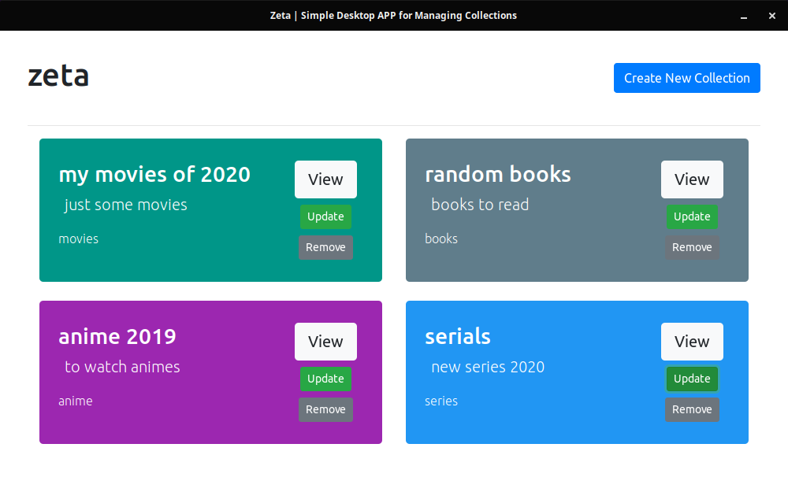

# zeta-desk

A simple desktop app for managing collections.

This is a simple desktop port of my simple web app [**zeta**](https://github.com/TheBoringDude/zeta)

#### Screenshot



### NOTE:

I am a beginner with using `go` and `react` :sweat_smile:, and my code is very messy. Appreciate help in chunking and refactoring it. :blush:

### Issue:

- App suddenly crashes (Linux, not sure on other systems) when trying to continously remove collections or updating (or editing) a collection.

## ROADMAP

- [ ] Function to add, remove items to each collection
- [ ] Integrate APIs for adding items
- [ ] Get a better UI Design (maybe, .. )
- [ ] Refactor code
- [ ] Add new features...
- [ ] Fix bugs

## Development

### Used Packages

- [**Wails**](https://github.com/wailsapp/wails)
- React (generated from `wails`)

### Local

- Serve the wails app (backend)

```
wails serve
```

- Run the frontend (go first to the directory `cd frontend`)

```
npm run start
```

#### Made By:

**:heart: TheBoringDude**
